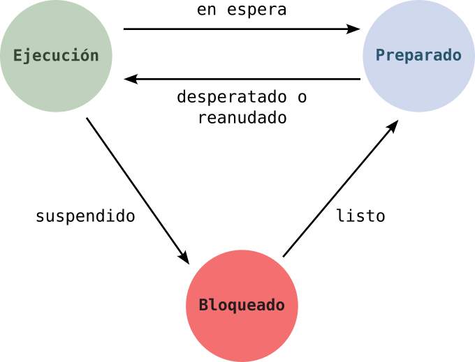
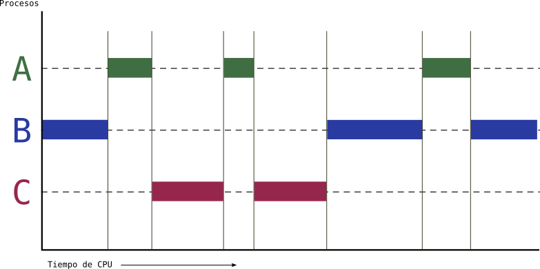
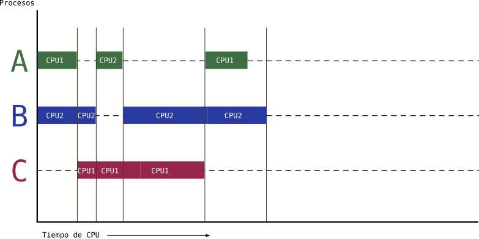

# Resultados de aprendizaje y criterios de evaluación

- **RA1**. Desarrolla aplicaciones compuestas por varios procesos reconociendo y aplicando principios de programación paralela.
  - **CE1a**. Se han reconocido las características de la programación concurrente y sus ámbitos de aplicación.
  - **CE1b**. Se han identificado las diferencias entre programación paralela y programación distribuida, sus ventajas e inconvenientes.
  - **CE1c**. Se han analizado las características de los procesos y de su ejecución por el sistema operativo.

# Procesos

Como ya sabrás a estas alturas, los programadores escriben programas con lenguajes de alto nivel que el ordenador no puede ejecutar. El código fuente de estos lenguajes tiene que ser traducido a lenguaje máquina y convertido en un ejecutable.

Un **fichero ejecutable** es aquel que tiene un formato determinado que el Sistema Operativo reconoce y puede cargar en la memoria para empezar su ejecución.

> En Linux los ficheros ejecutables tienen formato `ELF` y en Windows formato `PE` (*Portable Executable*), por poner dos ejemplos.

Entendido esto, un **proceso**, informalmente, no es más que un **programa en ejecución**. Así que, cuando el Sistema Operativo carga el programa ejecutable en memoria y da comienzo su ejecución, a partir de este momento, ya lo podemos llamar **proceso**.

Los **procesos están bajo el control del Sistema Operativo** que será el encargado de proporcionar los recursos que necesita: otorgar tiempo de ejecucion en la CPU, proporcionar recursos como memoria y almacenamiento secundario, acceso a los periféricos, etc.

## Gestión de procesos por el Sistema Operativo

El Sistema Operativo gestiona los procesos por medio de lo que se conoce como **planificador de procesos**. Este planificador es el encargado de ofrecer tiempo de ejecución a cada proceso, para lo cual necesita mantener una estructura de procesos en la que por cada proceso se almacena::

- Un **PID**: cada proceso tiene un **Process IDentifier** o PID que lo identifica de forma única.
- Un espacio de **direcciones de memoria** y lista de ubicaciones que va desde un mínimo a un máximo donde el proceso puede leer y/o escribir datos en memoria.
- El contenido de los **resitros de la CPU** para que cuando se vuelva a otorgar tiempo de ejecución se pueda restaurar el estado en que se encontraba la CPU en el momento en que se cambió por otro proceso.
- **Otros recursos** como ficheros que tiene abiertos.

## Estados de un proceso

En un ordenador existen muchos procesos en ejecución al mismo tiempo. A esto se le conoce como **computación concurrente**: varios procesos ejecutándose al mismo tiempo.

El planificador de procesos del Sistema Operativo aplica ciertos algoritmos para permitir que varios procesos puedan usar la misma CPU o recursos, otorgando tiempo a todos los procesos sobre estos recursos, y moviendo a todos estos procesos a través de una **maquinaria de estados**. Los estados en que se puede encontrar un proceso son:

- **Ejecución**: el proceso se está ejecutando en un procesador.
- **Preparado**: si un proceso está en este estado, el Sistema Operativo lo puede seleccionar para pasar al estado de **ejecución**.
- **Bloqueado**: a este estado entra un proceso cuando realiza algún tipo de operación que hace que no pueda seguir ejecutándose hasta que un evento tenga lugar. Los procesos en este estado no pueden ser seleccionados por el Sistema Operativo para pasar al estado de **ejecución**.

> Un ejemplo típico, por el cual un proces pasa al estado de bloqueado, es cuando inicia una operación de Entrada/Salida como puede ser la lectura de un fichero. En este caso hasta que no esté el fichero listo el proceso no puede seguir ejecutándose.

En esta **maquinaria de estados** vemos como el planificador va *durmiendo* y *despertando* procesos para alternarlos entre los estados de **Ejecución** y **Preparado**. Además, cuando un proceso necesita un recurso de Entrada/Salida (por ejemplo, abrir un fichero) es *suspendido* y pasa al estado de **Bloqueado**. Una vez está el recurso de Entrada/Salida listo es devuelto al estado de **Preparado**.

# Programación concurrente

La **computación concurrente** es la que permite que varias tareas se puedan ejecutar durante el mismo periodo de tiempo. La **programación concurrente** es la ténica de programación que permite crear sistemas donde **varios procesos** se puedan ejecutar al mismo tiempo.

Hay que llevar cuidado con este concepto porque **se suele confundir con computación o programación paralela**, las cuales están relacionadas pero son diferente como se verá más adelante.

Te explico con un ejemplo en qué consiste la computacion concurrente y cómo funciona, aunque en el apartado anterior ya se ha hecho de forma implícita. Imagina un sistema en el que hay tres procesos ejecutándose durante el mismo tiempo, es decir, concurrentemente. Estos tres procesos son `A`, `B` y `C`. No obstante, **solo hay una CPU**, por lo que solo un proceso puede ejecutarse en la CPU en un instante dado. El planificador del Sistema Operativo decidierá en cada momento qué proceso se ejecuta en dicha CPU. Este podría ser el gráfico temporal de ejecución de los procesos `A`, `B` y `C`:

Como se aprecia en el gráfico hay tres procesos en ejecución al mismo tiempo (concurrentemente) pero no hay paralelismo porque en cada instante solo un proceso está siento ejecutado por la CPU.

# Programación paralela

Para que haya **computación paralela** es necesario que existan computación concurrente. La diferencia está en que los procesos se pueden ejecutar en paralelo porque, por ejemplo, hay varias CPU. La **programación paralela** es la técnica a través de la cual se explota la presencia de varias CPU para dividir el trabajo entre ellas, acortando el tiempo de ejecución.

Con el siguiente gráfico debería quedar clara la diferencia entre concurrencia y paralelismo. En el escenario representado por este gráfico existen dos CPU: CPU1 y CPU2, por eso se pueden ejecutar hasta dos procesos juntos:

En la imagen se pueden ver los tres procesos anteriores y cómo se van ejecutando en la `CPU1` y la `CPU2` en función de las necesidades. Verás, que el tiempo total de ejecución se ha acortado bastante. La computación paralela permite acortar tiempos de ejecución totales aunque la gestión del planificador se complica.

# Programación distribuida

La **computación distributida** es aquella en al que hay varios ordenadores conectados en red donde se distribuyen las tareas o procesos, consiguiendo así el paralelismo explicado anteriormente. La **programación distributida**, por tanto, es la técnica en la que escriben programas que trabajan coordinadamente en esta red de ordenadores distribuidos.

En realidad, es un tipo de computacion paralela en la que se emplean varios ordenadores en vez de varias CPU en un mismo ordenador.

No obstante, cuando hablemos de **computación paralela** nos referiremos a **un único ordenador con varias CPU** y cuando hablemos de **computación distributida** nos referiremos a **varios ordenadores conectados por red para repartir el trabajo o los procesos**.
