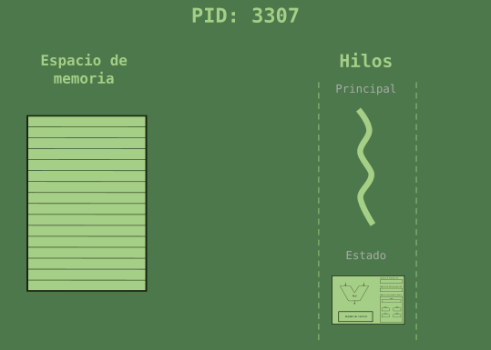
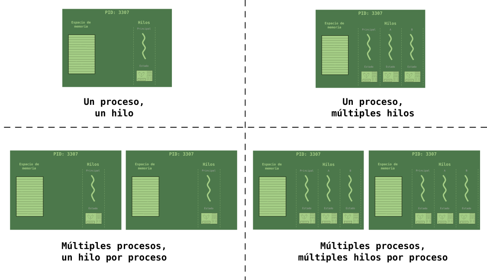

# Resultados de aprendizaje y criterios de evaluación

- **RA1**. Desarrolla aplicaciones compuestas por varios procesos reconociendo y aplicando principios de programación paralela.
  - **CE1c**. Se han analizado las características de los procesos y de su ejecución por el sistema operativo.
  - **CE1d**. Se han caracterizado los hilos de ejecución y descrito su relación con los procesos.

# Hilos

Con la introducción de los **hilos** vamos a completar la definición de **proceso**. Hasta ahora nos hemos quedado con que un proceso es un programa en ejecución bajo el control del Sistema Operativo. Así pues, el término proceso es una abstracción del Sistema Operativo que incluye: una espacio de memoria, el estado de la CPU, un identificador del proceso y un estado de ejecución (en ejecución, en espera o bloqueado).

Pues bien, cuando el Sistema Operativo crea un proceso, además de todo eso, asigna un **hilo de ejecución** a dicho proceso (el **hilo principal**). Simplificando las cosas, para entenderlo, podemos decir que a lo que llamamos hilo es al código de ejecución del proceso.

Así pues, un proceso lo podríamos representar como se muestra en la siguiente imagen:

## Multiproceso vs multihilo

Como veremos en breve, podemos escribir programas con varios hilos de ejecución, aprovechando la concurrencia y el paralelismo. Estos hilos forman parte del mismo proceso, así que **comparten el espacio de memoria del proceso** aunque cada hilo es una unidad de ejecución separada.

> En Linux, podemos usar la llamada la sistema `thread` para crear hilos dentro de un proceso.

Los hilos son tratados por el planificador de tareas como si fuera un proceso independiente (una especie de *miniproceso*) y, por tanto, cada hilo puede estar en uno de los tres estados ya conocidos: en ejecución, en espera o bloqueado.

En la siguiente imagen se resumen las cuatro posibilidades que se pueden dar:

Ahora bien, surgen dos preguntas: **¿qué diferencia hay entre crear procesos o hilos?**, **¿cuándo usar varios procesos y cuando usar varios hilos?**

Crear un proceso implica que hay que asignar un espacio de direcciones de memoria al proceso, asignarle un identificador, crear el hilo principal del proceso y, en general, crear la estructura completa. Sin embargo, crear un hilo es más rápido y "sencillo" porque se hace dentro de un proceso ya creado.

> Según Andrew Tanenbaum, en su libro Sistemas Operativo Modernos, la creación de hilos puede ser de 10 a 100 veces más rápido que la creación de procesos. Así pues, si se van a realizar tareas que acaban rápido quizás crear un proceso no sea conveniente.

A la segunda pregunta, ¿cuándo crear procesos y cuándo crear hilos?, se puede responder de forma básica tal que así: usaremos **hilos para actividades pequeñas** dentro de un mismo proceso, donde se tienen que crear y destruir hilos rápidamente; y usaremos **procesos para** dividir **tareas pesadas** dentro de un proceso que llevan mucho tiempo.

## Definición de hilo

Entendido todo esto llegamos, por fin, a la **definición de hilo**: pequeña secuencia de instrucciones programadas dentro de un proceso que pueden ser manejadas independientemente por el planificador de tareas del Sistema Operativo.
