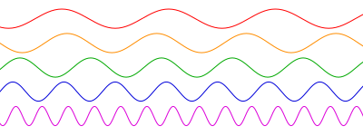

# Resultados de aprendizaje y criterios de evaluación

- **RA1**. Desarrolla aplicaciones compuestas por varios procesos reconociendo y aplicando principios de programación paralela.
  - **CE1a**. Se han reconocido las características de la programación concurrente y sus ámbitos de aplicación.
  - **CE1c**. Se han analizado las características de los procesos y de su ejecución por el sistema operativo.

# Caso práctico: ejecución concurrente y paralela

En este caso práctico vamos a hacer de "Sistema Operativo" en la ejecución de tres procesos que vamos a llamar `P1`, `P2` y `P3`.

Pero antes: las CPU usan un reloj que genera ciclos de reloj, una frecuencia que emplea para realizar sus tareas como pueden ser las de ejecutar una instrucción, acceder a memoria, etc.

De ahí que una de las cracterísticas de las CPU es la frecuencia medida en múltiplos del Hz (Hertzio). Hoy en día ese múltiplo es el del GHz (Giga Hertzio). Por ejemplo, el *Intel i5 1335U* trabaja a una frecuencia de 3,30 GHZ (4,40 GHz en modo *Turbo*).

> Recuerda que 1 GHz son 1 000 000 000 Hz. Eso significa, que la CPU *Intel i5 1335U* genera 1 000 000 000 ciclos cada segundo. Eso, a su vez, significa que si puede ejecutar una instrucción por ciclo, entonces, es capaz de ejecutar 1 000 000 000 instrucciones por segundo.

Una frecuencia se puede representar por medio de una onda sinusoidal. En el siguiente diagrama puedes ver representadas 5 frecuencias (el diagrama se ha obtenido de la [Wikipedia](https://es.wikipedia.org/wiki/Frecuencia)):

La frecuencia representada en color rojo es la menor y la representada por el color rosa es la mayor. Así, en el contexto de las CPU, llamamos ciclo a cada una de las repeticiones que se ven en la onda sinusoidal:

Dependiendo de la frecuencia, cada ciclo tiene una duración determinada que ronda, hoy en día, los *nanosegundos*.

Entendido todo esto, podemos pasar al primero de los casos prácticos.

## Ejecución concurrente

En un sistema de una sola CPU tenemos que ejecutar los tres procesos siguientes:

- `P1` que necesita **130 ciclos** de procesador.
- `P2` que necesita **80 ciclos** de procesador.
- `P3` que necesita **150 ciclos** de procesador.

El Sistema Operativo usa una cola FIFO en la que asigna turnos de 30 ciclos a cada proceso, comenzando por el `P1`, siguiendo por el `P2` y terminando por el `P3`. Además, el cambio de contexto supone al Sistema Operativo un uso de la CPU de 10 ciclos.

Dadas estas condiciones, vamos a responder a estas cuestiones:

- ¿Cuántos ciclos van a pasar hasta que termine el proceso `P1`, `P2` y `P3`?
- ¿Cuántos cambios de contexto ha hecho el Sistema Operativo?
- ¿Cuántos ciclos ha necesitado el Sistema Operativo en los cambios de contexto?
- ¿En total, cuántos ciclos de procesador se han necesitado para la ejecución de los tres procesos?

Podemos construir un diagrama en cuyo eje X tenemos el número de ciclos y en el eje Y tenemos los procesos:

Las respuestas a las preguntas anteriores, una vez desarrollado el diagrama, son:

- `P1` termina a los 420 ciclos; `P2` termina a los 300 ciclos; y `P3` termina a los 480 ciclos.
- El Sistema Operativo ha tenido que hacer 12 cambios de contexto.
- El Sistema Operativo ha necesitado un tota lde 120 ciclos de CPU.
- La CPU ha necesitado 480 ciclos para completar la ejecución de los tres procesos.

## Programación paralela (reto)

Imagina que, ahora, tenemos un sistema multiprocesador, con 3 CPU: `CPU1`, `CPU2` y `CPU3`. Se van a ejecutar los mismos tres procesos `P1`, `P2` y `P3` del caso anterior.

Dibuja el diagrama de ciclos de ejecución y responde a las mismas cuestiones:

- ¿Cuántos ciclos van a pasar hasta que termine el proceso `P1`, `P2` y `P3`?
- ¿Cuántos cambios de contexto ha hecho el Sistema Operativo?
- ¿Cuántos ciclos ha necesitado el Sistema Operativo en los cambios de contexto?
- ¿En total, cuántos ciclos de procesador se han necesitado para la ejecución de los tres procesos?
