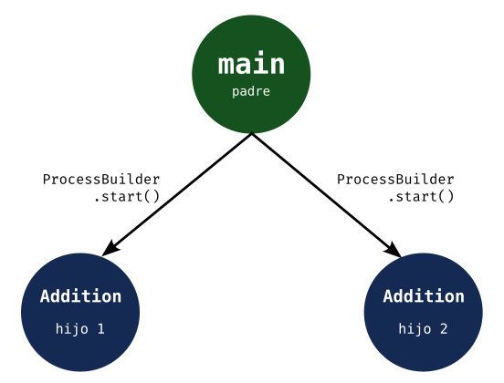

# Resultados de aprendizaje y criterios de evaluación

- **RA1**. Desarrolla aplicaciones compuestas por varios procesos reconociendo y aplicando principios de programación paralela.
  - **CE1e**. Se han utilizado clases para programar aplicaciones que crean subprocesos.
  - **CE1f**. Se han utilizado mecanismos para sincronizar y obtener el valor devuelto por los subprocesos iniciados.
  - **CE1g**. Se han desarrollado aplicaciones que gestionen y utilicen procesos para la ejecución de varias tareas en paralelo.
  - **CE1h**. Se han depurado y documentado las aplicaciones desarrolladas.

# Procesos en Kotlin

La JVM (*Java Virtual Machine*) se ha diseñado para soportar programación concurrente:

- La funcionalidad básica se proporciona a través de la clase `Process`, que es abstracta y no se pueden crear objetos de ella. Hay que usar subclases como veremos más adelante.

- La funcionalidad básica para los hilos se proporciona a través de la clase `Thread` (que abordaremos en el tema siguiente).

- El paquete `java.util.concurrent` proporciona funcionalidd de alto nivel para programación concurrente.

Centrándonos en los procesos (y la clase `Process`) tenemos dos métodos, de sendas clases, que nos permiten crear procesos, a saber: `ProcessBuilder.start()` y `Runtime.exec()`.

# La clase Runtime

Esta clase porporiona información del entorno de ejecución del proceso y nos permite interactura con él. Además, el método `exec()` permite lanzar nuevos procesos (que serán hijos del actual, del que hace la llamada).

Un ejemplo de uso lo tienes en el siguiente ejemplo, comentado para que se entienda cada instrucción:

```kotlin
// Obtenemos el objeto Runtime del entorno de ejecución actual.
val runtime = Runtime.getRuntime()

// Se crear un proceso hijo que ejecuta el comando "ls -l".
val childProcess = runtime.exec(arrayOf("ls", "-l"))

// Se imprimen por pantalla los PID de los procesos padre e hijo.
// El PID del proceso padre lo obtenemos con la clase ProcessHandle.
// El PID del proceso hijo directamente del objeto Process que crea exec.
println("PID parent process: ${ProcessHandle.current().pid()}")
println("PID child process: ${childProcess.pid()}")
```

Si deseas obtener el resultado del proceso hijo, lo tienes que hacer a través de la entrada/salida estándar. Lo que imprime por pantalla el proceso hijo puede ser capturado por el proceso padre. Para ello hay que utilizar *input stream* como se ve en este ejemplo, donde he completado el anterior para recuperar la salida del proceso hijo:

```kotlin
// Obtenemos el objeto Runtime del entorno de ejecución actual.
val runtime = Runtime.getRuntime()

// Se crear un proceso hijo que ejecuta el comando "ls -l".
val childProcess = runtime.exec(arrayOf("ls", "-l"))

// Se imprimen por pantalla los PID de los procesos padre e hijo.
// El PID del proceso padre lo obtenemos con la clase ProcessHandle.
// El PID del proceso hijo directamente del objeto Process que crea exec.
println("PID parent process: ${ProcessHandle.current().pid()}")
println("PID child process: ${childProcess.pid()}")

// Capturamos, desde aquí (el padre), la salida del proceso hijo.
// Esta instrucción es bloqueante: el proceso padre queda detenido aquí
// a la espera de que termine el proceso hijo.
val output = childProcess.inputStream.bufferedReader().readText()

// Imprimimos por pantalla, aquí (en el proceso padre), la salida.
println(output)
```

# La clase Process

Como ya he comentado, la clase `Process` es abstracta y no se puede instanciar. Pero tenemos clases derivadas como `ProcessBuilder` que podemos usar para crear procesos.

Veamos, directamente, cómo usar `ProcessBuilder` para escribir el mismo programa que el anterior con `Runtime`:

```kotlin
// Creamos objeto ProcessBuilder.
// Los comandos se indican en una lista de "vargs".
val processBuilder = ProcessBuilder("ls", "-l")

// Se crea y ejectua el proceso hijo.
val childProcess = processBuilder.start()

// Se imprimen por pantalla los PID de los procesos padre e hijo.
// El PID del proceso padre lo obtenemos con la clase ProcessHandle.
// El PID del proceso hijo directamente del objeto Process que crea exec.
println("PID parent process: ${ProcessHandle.current().pid()}")
println("PID child process: ${childProcess.pid()}")

// Capturamos, desde aquí (el padre), la salida del proceso hijo.
// Es bloqueante: el proceso padre se bloquea aquí hasta que termine el hijo.
val output = childProcess.inputStream.bufferedReader().readText()

// Imprimimos por pantalla, aquí (en el proceso padre), la salida.
println(output)
```

¿Qué diferencia hay entre `Runtime` y `ProcessBuilder`? En ejemplos sencillos, como estos, ninguna. Pero si queremos configurar, por ejemplo, el entorno de ejecución tendremos que usar `ProcessBuilder`.

## Configurar entorno de ejecución

Cuando ejecutamos un proceso, a veces, será necesario hacerlo desde un directorio de trabajo concreto; o necesitaremos cargar las variables de entorno; o un ejecutable conreto; etc. A todo este contexto, a toda esta información, se le conoce como **entorno de ejecución** del proceso.

La información del entorno en que se ejecuta un proceso lo podemos obtener con el método `System.getProperty`. Por ejemplo:

- `System.getProperty("java.class.path")` para obtener el `PATH` de la *Java Virtual Machine*.
- `System.getProperty("java.home")` para obtener el directorio donde está instalado la *Java Virtual Machine*.
- `System.getProperty("user.dir")` para obtener el directorio personal del usuario que ejecuta el proceso.

Puedes ver todas las opciones [en esta web](https://docs.oracle.com/javase/tutorial/essential/environment/sysprop.html).

Si quieres conocer todo el entorno en el que se ejecuta un proceso, ejecuta este programa:

```kotlin
val pb = ProcessBuilder("ls")
val childProcess = pb.start()

pb.environment().forEach { k, v ->
    println("$k: $v")
}
```

Para ver cómo configurar, en la práctica, un entorno concreto, veamos cómo ejecutar el comando `ls` en el directorio del usuario que lo ejecuta:

```kotlin
val userDir = System.getProperty("user.home")
val processBuilder = ProcessBuilder("ls", userDir)

val childProcess = processBuilder.start()
val output = childProcess.inputStream.bufferedReader().readText()

println(output)
```

## Cómo ejecutar una clase como un proceso

Hasta ahora hemos creado procesos que ejecutan comandos del sistema. Veamos, ahora, cómo crear un proceso para ejecutar un ejecutable de Kotlin/Java (un `class` o código compilado para la máquina virtual de java o *JVM*).

Para ejecutar un `class` vamos a necesitar que dicho `class` tenga el punto de entrada `main`. De ahí que, como ves en el siguiente código, tengamos la función `main` como entrada al programa principal (hilo principal del proceso padre) y el método `main` en la clase que queremos ejecutar en un nuevo proceso hijo (el código está documentado para que se comprenda):

> La *anotación* `@JvmStatic` convierte ese método en un método estático en el sentido tradicional de Java.

```kotlin
package com.proferoman

/**
 * Clase que se ejecutará en un proceso nuevo.
 *
 * Tiene un método que suma un rango de números llamado "add".
 *
 * Se ha añadido, además, un companion object con el método estático "main"
 * para que se pueda ejecutar como un proceso independiente.
 */
class Addition {
    fun add(n1: Int, n2: Int): Int {
        var result = 0
        for (i in n1..n2) {
            result += i
        }
        return result
    }

    companion object {
        @JvmStatic
        fun main(args: Array<String>) {
            if (args.isEmpty() || args.size < 2) {
                println("Two numbers are needed")
                return
            }

            val addition = Addition()
            val n1 = Integer.parseInt(args[0])
            val n2 = Integer.parseInt(args[1])
            addition.add(n1, n2);
        }
    }
}

/**
 * Función usada para crear un proceso que ejecute la clase Addition anterior.
 *
 * Al ejecutar la clase Addition como un nuevo proceso, se lanzará el método estático
 * main, como si de un programa independiente se tratara.
 */
fun launchAdder(n1: Int, n2: Int) {
    val className = "com.proferoman.Addition"
    val classPath = System.getProperty("java.class.path")

    // Crea objeto ProcessBuilder con el que crear un nuevo proceso.
    val processBuilder = ProcessBuilder(
        "kotlin", "-cp", classPath, className,
        n1.toString(), n2.toString()
    )
    // El "inheritIO" permite que el proceso hijo redirija la E/S al padre.
    // Así podemos ver los mensajes "prints" de los hijos.
    // Este "inheritIO" lo tendrás que quitar si quieres capturar la salida desde
    // el padre.
    val addProcess = processBuilder
        .inheritIO()
        .start()
}

/**
 * Punto de entrada al proceso padre (programa principal).
 */
fun main() {
    launchAdder(1, 100_000_000)
    launchAdder(1, 2)
}
```

> Si ejecutas el programa no vas a ver nada por pantalla. Los procesos que se crean calculan la suma del rango indicado y nada más. Luego veremos cómo obtener y pasar resultados desde un proceso hijo al proceso padre.

¿Cuántos procesos se crean al ejecutar el programa anterior? La respuesta es: 3 procesos. El proceso padre y los dos (hijos) que se crean al llamar a la función `launchAdder`. Esta sería la jerarquía de procesos:



Así pues, hay tres procesos cuya ejecución entra a ser planificada por el Sistema Operativo, así que no podemos conocer por adelantado qué proceso acabará antes que otro, dependerá de la planificación que haga dicho Sistema Operativo.

## Mostrar información de los procesos: prueba de concurrencia

Vamos a poner algunos `prints` al programa anterior y a modificar alguna cosa para que veamos que existe concurrencia entre los 3 procesos que se ejecutan. De hecho, en función del equipo en el que lo ejecutes y las condiciones de ejecución del ordenador, unos procesos acabarán antes que otros e, incluso, si lo ejecutamos varias veces el orden podría variar.

Este ejemplo también sirve para que veas un ejemplo de **cómo obtener información de un proceso**. Para ello, como ves debajo, se puede **usar la clase `ProcessHandle`** para mostrar el **PID** del proceso actual (*current*), por ejemplo.

Haz pruebas con este código. Leélo y trata de entenderlo. Solo he añadidoo algunos `prints` para ver información de los procesos que se ejecutan y ver cuándo empiezan y acaban su ejecución:

```kotlin
package com.proferoman

class Addition {
    fun add(n1: Int, n2: Int): Int {
        var result = 0
        for (i in n1..n2) {
            result += i
        }
        return result
    }

    companion object {
        @JvmStatic
        fun main(args: Array<String>) {
            println("Empieza proceso hijo: " + ProcessHandle.current().pid())
            if (args.isEmpty() || args.size < 2) {
                println("Two numbers are needed")
                return
            }

            val addition = Addition()
            val n1 = Integer.parseInt(args[0])
            val n2 = Integer.parseInt(args[1])
            addition.add(n1, n2);

            println("Finaliza proceso hijo: " + ProcessHandle.current().pid())
        }
    }
}

fun launchAdder(n1: Int, n2: Int) {
    val className = "com.proferoman.Addition"
    val classPath = System.getProperty("java.class.path")

    val processBuilder = ProcessBuilder(
        "kotlin", "-cp", classPath, className,
        n1.toString(), n2.toString()
    )
    val addProcess = processBuilder
        .inheritIO()
        .start()
}

fun main() {
    println("Empieza el proceso padre con PID: " + ProcessHandle.current().pid())
    launchAdder(1, 100_000_000)
    launchAdder(1, 2)
    println("Acaba el proceso padre con PID: " + ProcessHandle.current().pid())
}
```

Una posible salida, tras ejecutar este programa, sería:

```shell
Empieza el proceso padre con PID: 43795
Acaba el proceso padre con PID: 43795
Empieza proceso: 43861
Empieza proceso: 43866
Finaliza proceso: 43866
Finaliza proceso: 43861
```

Donde ves que:

- Acaba el proceso padre antes que los hijos.
- Acaba el segundo proceso hijo antes que el primero en ser creado.

Esta es una prueba de que el Sistema Operativo ha manejado tres procesos y, además, han sido ejecutados de forma concurrente y sin una secuencia dada.

## Manejando procesos: métodos útiles de la clase Process

Ya hemos visto, en los ejemplos anteriores, varios métodos de la clase `Process`. Aquí me voy a centrar en una serie de métodos útiles para el manejos de los procesos hijos que se crean desde un padre.

Aquí tienes una introducción a los métodos que te voy a explicar en este apartado:

- `destroy(): Unit`: este método permite acabar con un proceso hijo de forma limpia y ordenada.
- `destroyFocibly(): Process`: con este método terminas con el proceso inmediatamente.
- `exitValue(): Int`: devuelve el valor de salida y código de retorno.

> Todos los procesos terminan con un código (número entero) que indica cómo fue la ejecución de dicho proceso. Un valor igual a `0` indica que el proceso termino sin errores. Cualquier otro valor es un indicador de lo contrario.

- `isAlive(): Boolean`: este método permite comprobar si un proceso sigue ejecutándose.
- `waitFor(): Int`: con este método detenemos al proceso padre hasta que el hijo termine.
- `waitFor(timeout: Long, unit: TimeUnit): boolean`: con este método detenemos al proceso padre hasta que termine el proceso hijo o hasta que pase el tiempo indicado como argumentos. Devuelve `true` si el proceso termino antes de dicho tiempo o `false` en otro caso.
