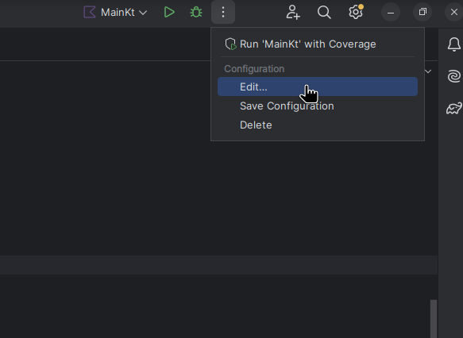
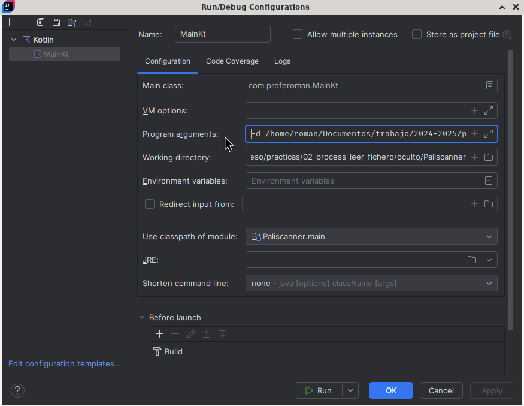

# Paliscanner

En esta práctica tienes que desarrollar un programa multiproceso en Kotlin que lea de los ficheros que se encuentren en una carpeta dada y extraiga de los mismos todas las palabras palíndromas que hayan.

Estos son los pasos que realizará el programa:

1. Recibirá, como argumento de entrada, una ruta absoluta a una carpeta.
2. Buscará todos los ficheros que haya en dicha carpeta.
3. Por cada fichero que encuentre creará un proceso hijo encargado de leer de ese fichero en busca de los palíndromos.
4. Cada proceso hijo escribirá en un fichero los palíndromos que encuentre separados por comas. Este fichero se llamará `<PID del proceso>.txt` y se encontrará en una carpeta llamada `output` dentro de la carpeta indicada en el paso 1.
5. Cuando terminen todos los procesos hijos, el proceso padre leerá de los ficheros de salida los palíndromos que ha encontrado cada hijo y los mostrará por pantalla.

Un ejemplo de salida, tras ejecutar el programa, podría ser este:

```text
Palíndromos encontrados:
- allá
- Salas
- sus
- Otto
- Ana
- Radar
- Eme
- Anilina
- reconocer
- Somos
- somos
- Oro
- oro
- ese
- Nilin
- Natan
- sometemos
- aérea
- Ala
- ala
- Ese
- solos
- seres
- menem
```

# Ficheros de ejemplo

En la carpeta `ficheros` que verás junto a este documento tienes tres ficheros que puedes usar para probar tu programa. La corrección se hará con otros, así que deberías generar tus propios ficheros y hacer pruebas más exhaustivas.

# Cómo especificar la carpeta en la línea de entrada

El programa esperará una opción llamada `-d` seguida del valor. Dicho valor será la ruta absoluta de la carpeta. Por ejemplo: `-d /home/psp/documentos/ficheros`

En IntelliJ puedes indicar la entrada al programa en *Program arguments* en la configuración del proyecto:





# Cómo obtener los argumentos de la línea de entrada

Como ya sabes la signatura de la función de entrada a un programa en Kotlin es `fun main(args: Array<String>)`. Esperamos que el array con la entrada llamado `args` contenga dos elementos:

1. el `String` "-d", y
2. un segundo `String` con la ruta a la carpeta dond están los ficheros

Lo primero que tiene que hacer tu programa es asegurarse que llegan estos dos argumentos. En otro caso acaba con un mensaje de error e indicando al usuario cómo usar el programa.

# Cómo saber si lo que nos han pasado es una carpeta

Podemos usar la clase `File` de Kotlin:

```kotlin
val file = File(pathDir)
if (!file.isDirectory) {
    println("$pathDir no es un directorio válido")
    return emptyList()
}
```

En este código `pathDir` es un `String` con la supuesta ruta absoluta de la carpeta.

# Cómo obtener la lista de ficheros que hay en una carpeta

De nuevo, la clase `File` es nuestra opción. La clase `File` tiene un método llamado `listFiles` que devuelve la lista de ficheros y carpetas que hay dentro del objeto `File` (si es una carpeta).

Este método, `listFiles`, acepta una *lambda* con la signatura siguiente: `(File) -> Boolean`. Como ves:

- Recibe un objeto de tipo `File`.
- Devuelve `true` o `false` que indica si se añade o no el fichero al resultado.

Si quieres obtener todos los ficheros, dejando de lado las carpetas:

```kotlin
file.listFiles { item -> item.isFile }
```

Esto devuelve un `Array` de `File`. Lo puedes convertir a una lista así:

```kotlin
file.listFiles { item -> item.isFile }
    ?.toList()
```

Lo que devuelve una lista de ficheros que podría estar vacía (fíjate en el operador opcional `?` delante del `.toList()`).

Por último, si quieres o estás interesado solo en la ruta de los objetos `File` resultantes de tipo `String`:

```kotlin
file.listFiles { item -> item.isFile }
    ?.toList()
    ?.map { it.path } ?: emptyList()
```

Usamos la función de orden superior `map` para obtener solo las rutas del objeto (que son del tipo `String`). Así pues, este código devuelve una lista de las rutas de los ficheros que están en la carpeta `File`. Esta lista podría estar vacía si no hay ficheros en la carpeta.

# Cómo leer, línea a línea, un fichero de texto en Kotlin

Imagina que `filePath` es la ruta al fichero a leer. El siguiente código lee líena a línea el contenido de este fichero mostrando por pantalla el mismo:

```kotlin
File(filePath).forEachLine {
    println(it)
}
```

Fíjate que, para variar, el método `forEachLine` recibe como argumento una *lambda* con un único argumento (en el ejemplo el argumento por defecto `it`) de tipo `String` que contiene la línea correspondiente.

# Cómo escribir en un fichero de texto en Kotlin

El siguiente código muestra cómo guardar una lista de nombres en un fichero separados por un espacio, seguido de dos punto, seguido de otro espacio. En él vemos cómo se crea fichero a través de un objeto de tipo `Path` con: ruta de la carpeta y nombre del fichero:

```kotlin
val names = ["Alice", "Bob", "Mary", "John"]
val outputFile = Path(outputDirectory, "fichero.txt").toFile()
outputFile.writeText(names.joinToString(" : "))
```

En el fichero encontraríamos este texto: "Alice : Bob : Mary : John".

# !OJO! a algunos detalles a tener en cuenta

- La palabra **ará** es un palíndromo pero la segunda 'a' tiene acento. Tenlo en cuenta porque tienes que lidiar con los acentos. Nos olvidamos de las diéresis y otras tildes, solo tendremos en cuenta los acentos españoles.
- La palabra **Otto** es un palíndromo pero la priemra 'o' está en mayúsculas. ¡Ojo con eso!
- Cuando *esplitees* un texto por los espacios para quedarte con las palabras podrías tener cosas tal que así: **otto?**, **otto,**, etc. Es decir, se van a quedar símbolos que tienes que considerar (quitar antes de comprobar si son o no palíndromos). Los símbolos a tener en cuenta serán estos: **"'?!¿¡,.;:**
- ¡Ten en cuenta esto! Si encuentras **Otto** en el texto tendrás que indicar que **Otto** es un palíndromo que es como se encontró originalmente (con la primera 'o' mayúscula). Es decir, mostramos las palabras originales, aunque para comprobar si es o no una palabra palíndroma tendrás que crear una copia con todo minúsculas y luego comparar.
- Puedes usar el método `reversed` de la clase `String` para darle la vuelta a una palabra.

# Por último y lo más importante

**No intentes resolver el problema complet**, ponte hitos más fáciles de alcanzar y, al finalizar cada hito, ves a por el siguiente hito. Por ejemplo:

1. Escribe un programa que lea de un fichero y que muestre por pantalla las palabras palíndromas.
2. Convierte el siguiente programa para que en vez de imprimir por pantalla las palabras palíndromas las escriba en un fichero separadas por comas. El fichero se tendrá que llamar `<PID del proceso>.txt`.
3. Dale otra vuelta al programa anterior para que dicho trabajo lo lleve a cabo un proceso hijo.
4. Añade la lógica para buscar los ficheros a leer en la carpeta que se le pase como argumento y crear tantos hijos como ficheros haya que leer.
5. Finalmente añade la opción de que el padre lea los ficheros resultantes y muestre todas las palabras palíndromas que hay en todos los ficheros dejados por los hijos.

# Instrucciones de entrega

Entregarás el `.zip` generado por GitHub al crear una *release* en Aules.

Así que, sí, tienes que crear un repositorio en GitHub llamado `paliscanner` donde subirás el código. Antes de empezar nada crea el proyecto de GitHub, hazlo privado y añádeme como colaborador para que pueda ver el código. Mi usuario de GitHub es **rgmf**.


