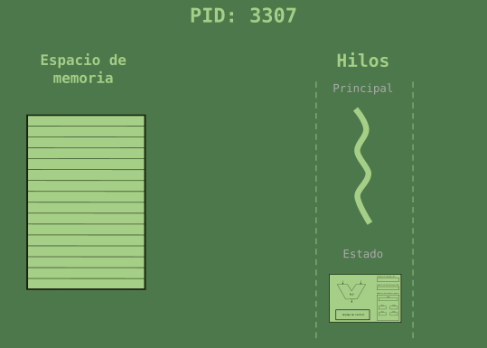
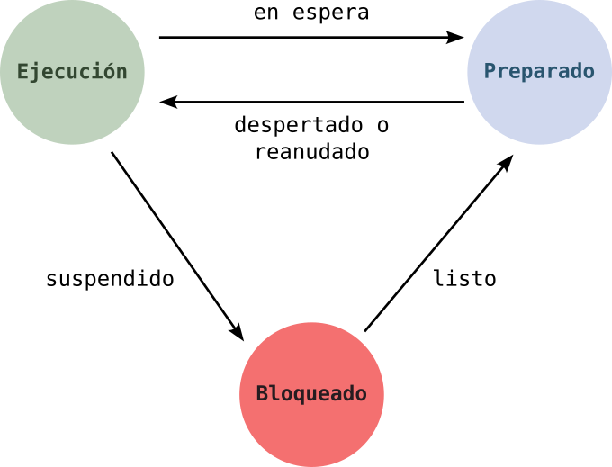
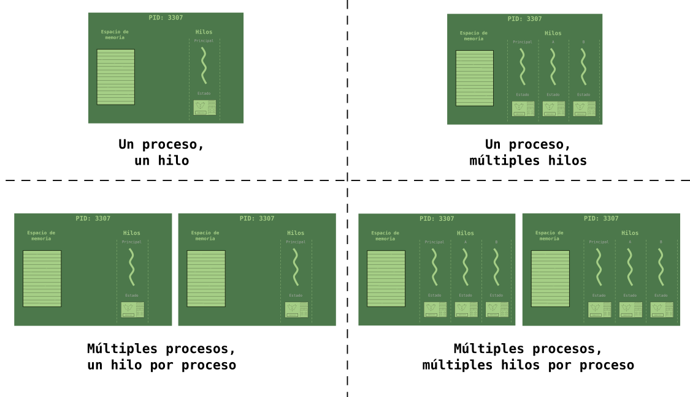

# Resultados de aprendizaje y criterios de evaluación

- **RA2**. Desarrolla aplicaciones compuestas por varios procesos reconociendo y aplicando principios de programación paralela.
  - **CE2a**. Se han identificado situaciones en las que resulte útil la utilización de varios hilos en un programa.
  - **CE2d**. Se han identificado los posibles estados de ejecución de un hilo y programado aplicaciones que los gestionen.

# Hilos

Como ya comenté en el tema anterior, y conviene recordar aquí, antes de comenzar a entrar de lleno en la programación multihilo, los hilos son **secuencias de instrucciones programadas dentro de un proceso** que pueden ser manejadas independientemente por el planificador de tareas del Sistema Operativo.

Recuerda que los hilos de un mismo proceso comparten:

- El PID del proceso.
- El espacio de memoria del proceso.

Y, cada uno, por separado, tiene:

- Un estado diferente: en ejecución, preparado o bloqueado.
- Un estado de la CPU diferente: utilizado por el Sistema Operativo para el cambio de contexto.

Por último, recordar que todo proceso tiene un hilo principal pero que se pueden crear más hilos, por lo que estos son los escenarios en que nos podemos encontrar cuando programamos aplicaciones multihilo/multiproceso:

# ¿Por qué hilos y programación multihilo?

La respuesta a esta pregunta hoy en día parece obvia porque tenemos ordenadores con CPU formadas por varios *cores* que pueden ejecutar varios hilos en paralelo, lo cual acelera mucho la ejecución de programas multihilo.

Pero la programacion multihilo también es útil para CPU con un único *core* ya que tareas bloqueantes, como son las tareas relacionadas con las operaciones de E/S, pueden ser lanzadas por otros hilos, manteniendo el hilo principal en ejecución y no bloqueado.

Lo indicado en el último párrafo es especialmente importante en aplicaciones que usan GUI (*Graphic User Interface*) como interfaz de comunicación con el usuario ya que dich GUI no puede ser bloqueada. En estas aplicaciones el hilo principal se encarga de mantener "viva" la GUI, dejando a otros hilos las tareas bloqueantes.
