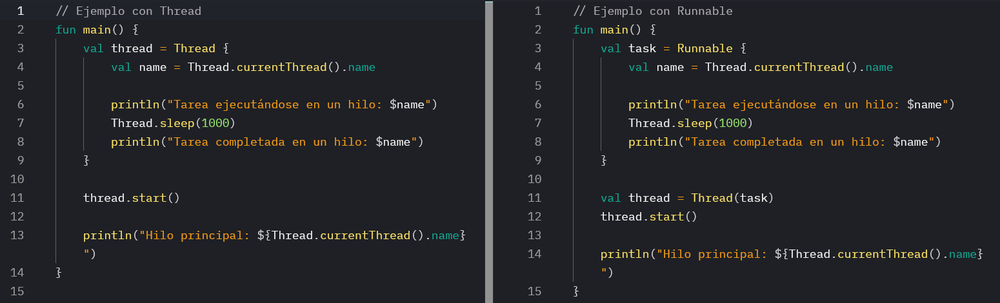

# Resultados de aprendizaje y criterios de evaluación

- **RA2**. Desarrolla aplicaciones compuestas por varios procesos reconociendo y aplicando principios de programación paralela.
  - **CE2b**. Se han reconocido los mecanismos para crear, iniciar y finalizar hilos.
  - **CE2c**. Se han programado aplicaciones que implementen varios hilos.
  - **CE2d**. Se han identificado los posibles estados de ejecución de un hilo y programado aplicaciones que los gestionen.

# La clase Runnable

Vayamos directos al ejemplo básico del apartado anterior hecho con la clase `Thread` y la clase `Runnable`. Debajo te explico las diferencias.



Como ves en ambos ejemplos se está usando la clase `Thread` que es la clase que gestiona el hilo. La clase `Runnable` la usamos para definir la tarea que el hilo va a ejecutar.

La pregunta aquí, pues, sería: ¿por qué usar entonces `Runnable`?, ¿por qué no utilizar directamente la clase `Thread` en la que, también, se indica el código a ejecutar? Las razones son varias pero las resumo en dos:

- **Separar tarea y control**: con `Runnable` definimos la tarea y con `Thread` controlamos el hilo. La separación de responsabilidades es siempre una buena idea en programación.

- **Reutilización y flexibilidad**: tener la tarea a ejecutar separada del hilo permite poder reutilizar dicha tarea en varios hilos.

# Creando tareas: heredando de Runnable

La mayoría de los casos, las tareas a realizar, tendrán una cierta complejidad, necesitarán recibir argumentos desde el exterior, etc. En estos casos podemos optar por dos opciones que te describo en los siguientes apartados.

## Solución 1: mediante una función que crea el Runnable

Simplemente, crea una función que reciba los argumentos necesarios del `Runnable` y el propio `Runnable`:

```kotlin
/**
 * Función que comprueba si un número es primo.
 */
fun isPrime(num: Int): Boolean {
    if (num < 2) {
        return false
    }

    for (i in 2..Math.sqrt(num.toDouble()).toInt()) {
        if (num % i == 0) {
            return false
        }
    }

    return true
}

/**
 * Función que crea el Runnable con los argumentos pasados.
 */
fun primeTask(start: Int, end: Int, primes: MutableList<Int>): Runnable {
    return Runnable {
        for (i in start..end) {
            if (isPrime(i)) {
                primes.add(i)
            }
        }
    }
}

/**
 * Función de entrada al programa.
 */
fun main() {
    // Listas para almacenar los números primos de cada rango
    val primes1 = mutableListOf<Int>()
    val primes2 = mutableListOf<Int>()

    // Crea las tareas
    val task1 = primeTask(1, 100, primes1)
    val task2 = primeTask(101, 200, primes2)

    // Crer hilos con las tareas
    thread1 = Thread(task1)
    thread2 = Thread(task2)

    // Iniciar los hilos
    thread1.start()
    thread2.start()

    // Esperar a que ambos hilos terminen
    thread1.join()
    thread2.join()

    // Combinar y mostrar los resultados
    val primes = primes1 + primes2
    println("Números primos entre 1 y 200: $primes")
}
```

## Solución 2: creando una clase que herede de Runnable

Otra opción sería crear un clase que herede de `Runnable`. En estos casos, hay que sobreescribir el método `run()` de la clase `Runnable` para definir la tarea a realizar:

```kotlin
/**
 * Función que comprueba si un número es primo.
 */
fun isPrime(num: Int): Boolean {
    if (num < 2) {
        return false
    }

    for (i in 2..Math.sqrt(num.toDouble()).toInt()) {
        if (num % i == 0) {
            return false
        }
    }

    return true
}

/**
 * Clase que define la tarea a realizar
 */
class PrimeTask(
    private val start: Int,
    private val end: Int,
    private val primes: MutableList<Int>
) : Runnable {

    override fun run() {
        for (i in start..end) {
            if (isPrime(i)) {
                primes.add(i)
            }
        }
        println("Hilo ${Thread.currentThread().name} completado. Primos de $start a $end encontrados.")
    }
}

/**
 * Función de entrada al programa.
 */
fun main() {
    // Listas para almacenar los números primos de cada rango
    val primes1 = mutableListOf<Int>()
    val primes2 = mutableListOf<Int>()

    // Crea las tareas
    val task1 = PrimeTask(1, 100, primes1)
    val task2 = PrimeTask(101, 200, primes2)

    // Crer hilos con las tareas
    thread1 = Thread(task1)
    thread2 = Thread(task2)

    // Iniciar los hilos
    thread1.start()
    thread2.start()

    // Esperar a que ambos hilos terminen
    thread1.join()
    thread2.join()

    // Combinar y mostrar los resultados
    val primes = primes1 + primes2
    println("Números primos entre 1 y 200: $primes")
}
```
