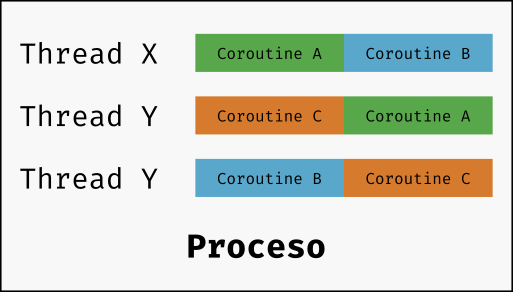

# Resultados de aprendizaje y criterios de evaluación

- **RA2**. Desarrolla aplicaciones compuestas por varios procesos reconociendo y aplicando principios de programación paralela.
  - **CE2a**. Se han identificado situaciones en las que resulte útil la utilización de varios hilos en un programa.
  - **CE2b**. Se han reconocido los mecanismos para crear, iniciar y finalizar hilos.
  - **CE2d**. Se han identificado los posibles estados de ejecución de un hilo y programado aplicaciones que los gestionen.
  - **CE2e**. Se han utilizado mecanismos para compartir información entre varios hilos de un mismo proceso.

# Introducción a las corrutinas en Kotlin

## Introducción a las corrutinas

Las **corrutinas son componentes** de los lenguajes de programación **que pueden ser suspendidos y reiniciados** (*suspended* y *resumed*) sin que por ello se detenga o bloquee el programa principal.

Según leemos en la [Wikipedia](https://es.wikipedia.org/wiki/Corrutina):

> una corrutina es una unidad de tratamiento semejante a una subrutina, con la diferencia de que, mientras que la salida de una subrutina pone fin a esta, la salida de una corrutina puede ser el resultado de una suspensión de su tratamiento hasta que se le indique retomar su ejecución (multitarea cooperativa). La suspensión de la corrutina y su reanudación pueden ir acompañadas de una transmisión de datos.

Todo esto lo podemos reducir a que, con las corrutinas, podemos crear **componentes asíncronos** y que, por tanto, no bloquean el hilo principal. Es por ello que, en muchos lenguajes, se han introducido instrucciones y palabras reservadas como `async`, `suspend`, `yield`, etc.

## kotlinx.coroutines

La programación asíncrona y no bloqueante es fundamental en aplicaciones del lado del servidor, para escritorio, para aplicaciones móviles y, en general, para aplicaciones con una GUI. Kotlin resuelve esta necesidad o este problema de una manera bastante flexible añadiendo soporte básico para las corrutinas en el mismo lenguaje y dejando o delegando la mayoría de la funcionalidad en bibliotecas.

Además de permitir la programación asíncrona, las corrutinas en Kotlin nos van a ofrecer otras posibilidades como con las concurrencia.

**kotlinx.coroutines** es una librería de corrutinas para Kotlin desarrollada por JetBrains que contiene un número de primitivas para trabajar con corrutinas a alto nivel, incluyendo construccciones del lenguaje como son **launch** y **async**, entre otras.

Así pues, a partir de ahora, cada vez que vayamos a crear un proyecto, vamos a necesitar añadir la biblioteca o módulo `kotlinx-coroutines-core`. Por ejemplo, en *Gradle*:

```kotlin
dependencies {
    implementation("org.jetbrains.kotlinx:kotlinx-coroutines-core:1.9.0")
}
```

## Relación entre corrutinas e hilos

Las corrutinas pueden ser pensadas como *hilos ligeros*, aunque hay diferencias que hacen que, en realidad, sean muy diferentes.

De hecho, una corrutina puede ser ejecutada por un hilo, ser suspendida y cuando se reinicia continuar su ejecución en otro hilo. Será Kotlin el encargado de ir creando hilos que sean utilizados para ir ejecutando las corrutinas.

Para ponerlo todo en contexto y que entendamos la relación que hay entre hilos y corrutinas, pero también cómo se integra todo esto en los procesos, te muestro esta imagen en la que hay que ejecutar tres corrutinas **A**, **B** y **C**. Vemos, en la imagen, que tres hilos han sido creados por Kotlin para ejecutar estas tres corrutinas, pero eso no significa que un hilo ejecute una corrutina de principio a fin. Fíjate como la **corrutina A** ha sido ejecutada por el **hilo X** y por el **hilo Y**. ¿Por qué ha podido ser eso así? Porque la corrutina fue suspendida mientras la estaba ejecutando el **hilo A** y cuando se reinició dicho **hilo A** estaba a otra cosa y paso a ser ejecutado por el **hilo Y**:


