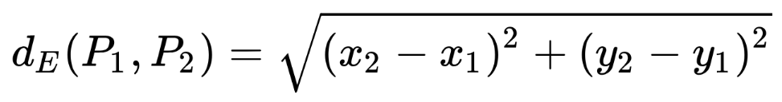
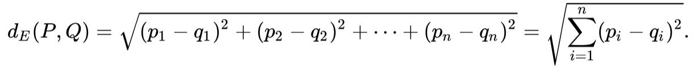

# Resultados de aprendizaje y criterios de evaluación

- **RA2**. Desarrolla aplicaciones compuestas por varios procesos reconociendo y aplicando principios de programación paralela.
  - **CE2a**. Se han identificado situaciones en las que resulte útil la utilización de varios hilos en un programa.
  - **CE2b**. Se han reconocido los mecanismos para crear, iniciar y finalizar hilos.
  - **CE2c**. Se han programado aplicaciones que implementen varios hilos.
  - **CE2d**. Se han identificado los posibles estados de ejecución de un hilo y programado aplicaciones que los gestionen.
  - **CE2e**. Se han utilizado mecanismos para compartir información entre varios hilos de un mismo proceso.
  - **CE2f**. Se han desarrollado programas formados por varios hilos sincronizados mediante técnicas específicas.
  - **CE2g**. Se ha establecido y controlado la prioridad de cada uno de los hilos de ejecución.
  - **CE2h**. Se han depurado y documentado los programas desarrollados.

# Ejercicio propuesto: distancia euclidiana

La distancia euclidiana se utiliza ampliamente en algoritmos de aprendizaje automático, procesamiento de señales, y en la búsqueda de similitudes entre vectores.

## Introducción a Euclides

¿En qué consiste? En matemáticas, la distancia euclidiana o euclídea, es la distancia "ordinaria" entre dos puntos de un espacio euclídeo, la cual se deduce a partir del teorema de Pitágoras.

Por ejemplo, en un espacio bidimensional, la distancia euclidiana entre dos puntos P1 y P2, de coordenadas cartesianas (x1, y1) y (x2, y2) respectivamente, es:

En general, la distancia entre los puntos `P = (p1, p2, ..., pn)` y `Q = (q1, q2, ..., qn)` es:

## Enunciado del programa a desarrollar

Escribe un programa que aproveche las corrutinas para calcular las distancias de 50 millones de puntos en un espacio tridimensional con respecto a un puto de referencia en `(0.0, 0.0, 0.0)` de dicho espacio tridimensional.

Puedes dividir la tarea entre 5 corrutinas, por ejemplo, para que cada una de ellas que se encargue de 10 millones de puntos.

El programa tendrá los 50 millones de distancias guardadas en una lista.

Vamos a usar número de tipo `Double`.

# Solución

El resultado de este ejercicio lo tiene [Aquí](./workout/distancia_euclidea/).
