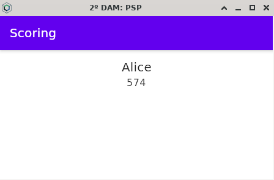
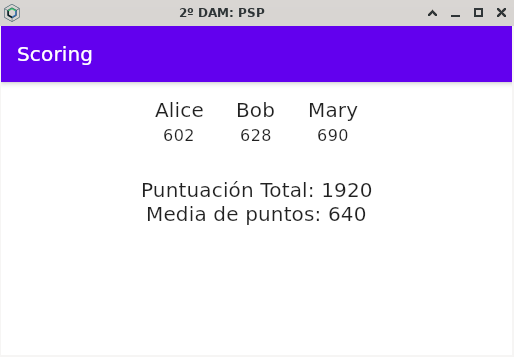

# Resultados de aprendizaje y criterios de evaluación

- **RA2**. Desarrolla aplicaciones compuestas por varios procesos reconociendo y aplicando principios de programación paralela.
  - **CE2a**. Se han identificado situaciones en las que resulte útil la utilización de varios hilos en un programa.
  - **CE2b**. Se han reconocido los mecanismos para crear, iniciar y finalizar hilos.
  - **CE2c**. Se han programado aplicaciones que implementen varios hilos.
  - **CE2d**. Se han identificado los posibles estados de ejecución de un hilo y programado aplicaciones que los gestionen.
  - **CE2e**. Se han utilizado mecanismos para compartir información entre varios hilos de un mismo proceso.
  - **CE2f**. Se han desarrollado programas formados por varios hilos sincronizados mediante técnicas específicas.
  - **CE2g**. Se ha establecido y controlado la prioridad de cada uno de los hilos de ejecución.
  - **CE2h**. Se han depurado y documentado los programas desarrollados.

# Ejercicio propuesto: contador de puntuaciones de un juego

## Parte 1: para un solo jugador

Crea un programa con Kotlin Multiplatform que simule un sistema en tiempo real para registrar y procesar puntuaciones de un juego utilizando Flow.

Hay un solo jugador y crearás un `Flow` para generar puntuaciones en un intervalo de tiempo al azar entre 2 y 5 segundos.

Crea un modelo (`data class` de Kotlin) para representar al jugador:

```kotlin
data class Player(
    val name: String,
    val score: Int
)
```

La función generadora de puntos debe tener la siguiente signatura:

```kotlin
fun generateScores(player: Player): Flow<Int> = flow {
    // Aquí dentro el código del generador de puntos...
}
```

Como ves, recibe un jugador y devuelve un `Flow<int>` con la nueva puntuación. Dicho generador generará una nueva puntuación entre 1 y 100 que sumará al `player` para generar la nueva puntuación.

Recuerda usar `LaunchedEffect` dentro del *composable* para ir obteniendo los puntos en una corrutina separada y actualiza el jugador con la nueva puntuación.

Te muestro una captura de pantalla de un momento del juego:



## Parte 2: multijugador

Trata de modificar el programa anterior para permitir que el juego sea multijugador. Hay varios jugadores (por ejemplo, Player1, Player2, Player3) y hay que ir generando puntuaciones para todos ellos.

Además de mostrar las puntuaciones que van consiguiendo todos ellos deberás mostrar:

- La puntuación total de todos los jugadores.
- La puntuación promedio.

Te muestro una captura de pantalla de un momento del juego:



# Soluciones

Puedes encontrar las soluciones a los ejercicios:

- [Aquí](./workout/one_score_with_flow) la primera parte, para un solo jugador.
- [Aquí](./workout/scores_with_flow), la segunda parte, para varios jugadores.
