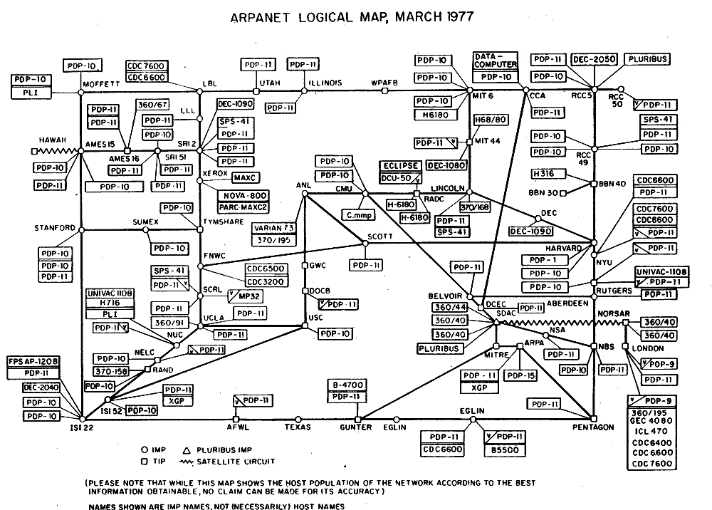

# Resultados de aprendizaje y criterios de evaluación

- **RA3**. Programa mecanismos de comunicación en red empleando sockets y analizando el escenario de ejecución.
  - **CE3a**. Se han identificado escenarios que precisan establecer comunicación en red entre varias aplicaciones.
  - **CE3b**. Se han identificado los roles de cliente y de servidor y sus funciones asociadas.

# Conceptos fundamentales de redes

## Historia de las redes: versión muy, muy corta

En los inicios de la computación los ordenadores eran elementos aíslados capaces de realizar calculos complejos y a gran velocidad (para la época, claro).

No muy tarde en el tiempo se crean las primeras redes de ordenadores que ocupaban espacios pequeños como son laboratorios o departamentos. Estas primeras redes conectaban ordenadores con impresoras o sistemas de almacenamiento.

El primer gran hito en las redes de ordenadores se da en **1969 con ARPANET**, que podemos considerar como el **embrión** de lo que más tarde se dio a conocer como **Internet**. En la imagen de abajo puedes ver el esquema lógico de ARPANET en 1977 (imagen obtenida en la [Wikipedia](https://es.wikipedia.org/wiki/Internet#/media/Archivo:Arpanet_logical_map,_march_1977.png)):

Dando un salto grande en el tiempo, llegamos al año **1981** cuando se establece el **protocolo TCP/IP** y surge el término de **Internet**. A estas alturas van surgiendo algunos protocolos y tecnologías de red que todavía usamos como son: **SMPT**, **SSH**, **Telnet**, **FTP**, entre otros. Aquí podemos destacar a Vinton Cerf y a Robert Kahn, que fueron los diseñadores del protocolo TCP/IP.

Todos estos **protocolos son definidos y estandarizados** en unos documentos denominados **RFC** (*Request For Commet*). En lo relacionado a los protocolos en Internet cabe mencionar a Jon Postel (en la imagen de abajo, obtenida en la [Wikipedia](https://es.wikipedia.org/wiki/Jon_Postel#/media/Archivo:Jon_Postel.jpg)) que participó en protocolos como TCP/IP o SMTP, entre otros, además de ser editor de los denominados RFC.

Por último, damos otro salto para llegar a los años 90, momento en que se crea la **WWW** (o *World Wide Web*), en el CERN, por Tim Berners Lee (foto de abajo, obtenida en la [Wikipedia](https://es.wikipedia.org/wiki/Tim_Berners-Lee#/media/Archivo:Sir_Tim_Berners-Lee_(cropped).jpg)). La **WWW**,también conocida simplemente como **La Web**, funciona sobre la red universal Internet a través de un protocolo llamado **HTTP** que permite la transferencia de *hipertexto* o **documentos HTML**.

## Términos de redes

Antes de continuar es muy importante que conozcas una serie de términos que vamos a usar recurrentemente a lo largo del tema:

- Host: llamamos host a un equipo conectado a una red
- Servidor: un servidor es un host que ofrece recursos al resto de host conectados a la misma red
- Cliente o Workstation: es un host que consume los servicios ofrecidos por los servidores de la misma red
- Protocolo: conjunto de normas y tecnologías estandarizadas

Así, las redes de ordenadores es un conjunto de elementos **hardware** y **software**. De hecho, un servidor no es más que un ordenador con un software específico que lo convierte en un equipo especial en la red que proporciona algún tipo de servicio.

*Spoiler*: en este tema vamos a aprender a escribir programas de servidor, con lo que convertiremos a un ordenador "normal" en uno "especial", el servidor. Pero antes, tenemos que estudiar brevemente el protocolo TCP/IP.
