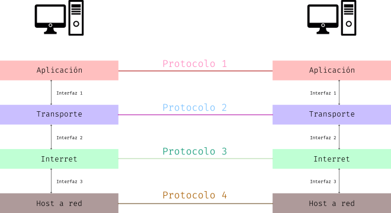
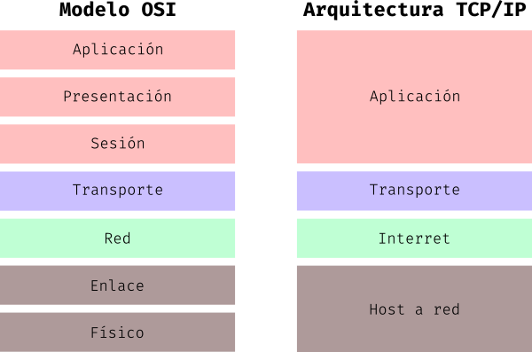
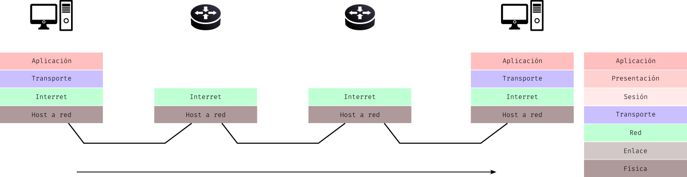

# Resultados de aprendizaje y criterios de evaluación

- **RA3**. Programa mecanismos de comunicación en red empleando sockets y analizando el escenario de ejecución.
  - **CE3a**. Se han identificado escenarios que precisan establecer comunicación en red entre varias aplicaciones.
  - **CE3b**. Se han identificado los roles de cliente y de servidor y sus funciones asociadas.

# Arquitectura TCP/IP

## Orígenes

Para que varios ordenadores se puedan comunicar entre sí por medio de una red es necesario que se pongan de acuerdo en las normas de comunicación que se van a seguir.

Dada la complejidad de estas comunicaciones y la multitud de opciones que hay, desde los inicios del desarrollo de las redes de datos, se impusieron las **arquitecturas de capas**, donde cada capa se especializa en tareas concretas y, como ves en la imagen de abajo, la **comunicación entre las capas pares se hace por medio de protocolos** y entre las **capas adyacentes por medio interfaces**.

En esta dirección tenemos un **modelo de referencia llamado OSI** (*Open System Interconnection*) que está formado por 7 capas. Y, por último, llegamos a la **Arquitectura TCP/IP** que es utilizada en Internet y las redes de datos actuales.

Cada una de estas capas se encarga de realizar e implementar los diferentes protocolos. En la siguiente imagen puedes ver la relación entre OSI y TCP/IP.

## Funcionamiento básico

Esta imagen resume, de forma conceptual, el funcionamiento de TCP/IP cuando un host envía un "mensaje" a otro host de la misma red:

El "mensaje" que se quiere enviar desde el host de la izquierda, se llevan a cabo estos pasos:

1. El "mensaje" pasa de la capa de Aplicación a la capa de Transporte a través de la interfaz Aplicación-Transporte.

2. La capa de Transporte prepara un paquete con una cabecera y pone lo que le llega de la capa de Aplicación en los datos de dicho paquete.

3. Una vez, la capa de Transporte, tiene preparado el paquete, lo envía a la capa de Interred a través de la interfaz Transporte-Interred.

4. En esta capa de Interred se prepara un paquete con una cabecera y pone en los datos lo que le llega de la capa de Transporte.

5. Una vez preparado el paquete en la capa de Interred se pasa hacia la capa Host a Red a través de la interfaz Interred-Host a Red.

6. La capa Host a Red pone una cabecer a lo que le llega de la capa de Interred y lo envía por el medio al host de destino.

7. El host de destino deshace el camino desde la capa de abajo hasta la capa de arriba, la de Aplicación, para obtener el "mensaje" original.

En las redes TCP/IP los paquetes que se envían por el medio pueden dar saltos por nodos intermedios, denominados routers, hasta llegar al destinatario, ya que es una red de conmutación de paquetes.

