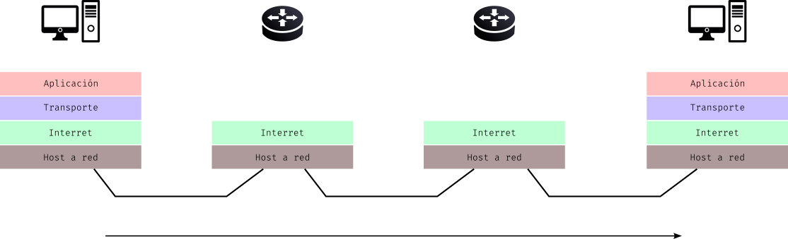

# Resultados de aprendizaje y criterios de evaluación

- **RA3**. Programa mecanismos de comunicación en red empleando sockets y analizando el escenario de ejecución.
  - **CE3a**. Se han identificado escenarios que precisan establecer comunicación en red entre varias aplicaciones.
  - **CE3b**. Se han identificado los roles de cliente y de servidor y sus funciones asociadas.

# Arquitectura TCP/IP

## Orígenes

Para que varios ordenadores se puedan comunicar entre sí por medio de una red es necesario que se pongan de acuerdo en las normas de comunicación que se van a seguir.

Dada la complejidad de estas comunicaciones y la multitud de opciones que hay, desde los inicios del desarrollo de las redes de datos, se impusieron las **arquitecturas de capas**, donde cada capa se especializa en tareas concretas y, como ves en la imagen de abajo, la **comunicación entre las capas pares se hace por medio de protocolos** y entre las **capas adyacentes por medio interfaces**.

En esta dirección tenemos un **modelo de referencia llamado OSI** (*Open System Interconnection*) que está formado por 7 capas. Y, por último, llegamos a la **Arquitectura TCP/IP** que es utilizada en Internet y las redes de datos actuales.

Cada una de estas capas se encarga de realizar e implementar los diferentes protocolos. En la siguiente imagen puedes ver la relación entre OSI y TCP/IP.

## Funcionamiento básico

Esta imagen resume, de forma conceptual, el funcionamiento de TCP/IP cuando un host envía un mensaje a otro host de la misma red:

Cuando el host de la izquierda envía un mensaje al host de la derecha, se llevan a cabo estos pasos:

1. En la capa de aplicación tenemos los datos que se desea enviar, el **mensaje**. Este pasa **de la capa de Aplicación a la capa de Transporte** a través de la **interfaz** Aplicación-Transporte.

2. **La capa de Transporte prepara un segmento** con una cabecera y pone lo que le llega de la capa de Aplicación en los datos de dicho paquete.

3. Una vez, **la capa de Transporte**, tiene preparado el segmento, **lo envía a la capa de Interred** a través de la **interfaz** Transporte-Interred.

4. **En esta capa de Interred se prepara un paquete** con una cabecera y pone en los datos lo que le llega de la capa de Transporte.

5. Una vez preparado el paquete, **la capa de Interred pasa hacia la capa Host a Red** dicho paquete a través de la **interfaz** Interred-Host a Red.

6. **La capa Host a Red prepara una trama** en la que pone una cabecera a lo que le llega de la capa de Interred y lo **envía por el medio** al host de destino.

> En las redes TCP/IP los paquetes que se envían por el medio pueden dar saltos por nodos intermedios, denominados routers, hasta llegar al destinatario, ya que es una red de conmutación de paquetes.

Así, lo que se envía desde un host podría ser representado por medio de un modelo de capas en el que, como ves en la imagen, al mensaje o datos original se el añaden cabeceras de cada una de las capas.

## Protocolos

La arquitectura TCP/IP se llama así porque los dos protocolos principales son TCP e IP. TCP es el protocolo de la capa de transporte e IP el protocolo de la capa de Interred. No obstante, hay más protocolos que te explico en los siguientes apartados.

Vas a ver que cada protocolo está vinculado a una capa de la arquitectura TCP/IP. Vamos a empezar por la capa inferior e iremos subiendo hasta la capa de Aplicación.

### Protocolos de la Capa Host a Red

Aquí se usan dos protocolos:

- **Ethernet** o **IEEE 802.3**: para medios guiados.
- **WiFi** o **IEEE 802.11**: para medios inalámbricos.

Ambos protocolos usan **MAC** (*Medium Access Control*), que es un subprotocolo responsable de **gestionar el acceso al medio físico**. MAC determina cómo los dispositivos en una red comparten el medio de transmisión y evita colisiones, asegurando que los datos se envíen de manera eficiente y ordenada.

Además, MAC define las **direcciones físicas** de las tarjetas de red o **direcciones MAC**. Estas direcciones MAC son únicas para cada tarjeta y **constan de 48 bits** (6 grupos de 8 bits separados por el carácter dos puntos).

Las direcciones MAC se suelen expresar en hexadecimal. Alguna direcciones MAC (al azar) son:

- `4f:5b:e0:01:15:a4`
- `fe:14:84:bf:ea:00`

### Protocolo de la Capa de Interred

El protocolo que se usa en esta capa se denomina **IP** (*Internet Protocol*) y se encarga del direccionamiento y el enrutamiento de la información que se envía por redes TCP/IP.

Este protocolo realiza las siguiente funciones:

1. **Dirección**: IP asigna una dirección única a cada dispositivo en una red, conocida como **dirección IP**. Esta dirección permite identificar de manera única a cada dispositivo y es esencial para la entrega de datos. Las direcciones IP pueden ser de dos tipos:

- **IPv4**: utiliza un formato de 32 bits, representado como cuatro números decimales separados por puntos (por ejemplo, 192.168.1.1). Este formato permite aproximadamente 4.3 mil millones de direcciones únicas.

- **IPv6**: utiliza un formato de 128 bits, representado como ocho grupos de cuatro dígitos hexadecimales separados por dos puntos (por ejemplo, 2001:0db8:85a3:0000:0000:8a2e:0370:7334). IPv6 fue desarrollado para abordar la escasez de direcciones IPv4.

2. **Enrutamiento**: IP se encarga de determinar la mejor ruta para enviar los paquetes de datos desde el origen hasta el destino. Esto se realiza a través de dispositivos de red llamados routers, que analizan la dirección IP de destino y deciden cómo enviar el paquete a su destino final.

3. **Fragmentación y reensamblaje**: si un paquete de datos es demasiado grande para ser transmitido a través de una red, IP puede fragmentarlo en partes más pequeñas. Cada fragmento se envía por separado y luego se reensambla en el destino.

4. **Transporte de datos**: IP no garantiza la entrega de paquetes, la secuenciación o la corrección de errores. Para estas funciones, se utilizan protocolos de la capa de transporte (los vemos en el siguiente apartado).

IP es un protocolo esencial que permite la comunicación entre dispositivos en una red al proporcionar direcciones únicas y gestionar el enrutamiento de paquetes de datos. Es una parte fundamental de la infraestructura de Internet y de muchas redes privadas.

### Protocolos de la Capa de Transporte

En la Capa de Transporte tenemos dos protocolos: **TCP (Transmission Control Protocol)** y **UDP (User Datagram Protocol)**.

**TCP** es un protocolo confiable y orientado a la conexión, lo que quiere decir que garantiza la entrega de los paquetes y, antes de comenzar con la comunicación, se establece una conexión con el host de destino, hay un principio y un final en la comunicación.

**UDP** es un protocolo que no es confiable ni orientado a la conexión, lo que quiere decir que con este protocolo no se garantiza la entrega de los paquetes.

En cualquier caso, se utilice uno u otro protocolo, la Capa de Transporte proporciona un mecanismo para distinguir distintas aplicaciones dentro de una misma máquina, a través del concepto denominado **puerto**. Así, se pueden hacer solicitudes a una misma máquina con diferentes aplicaciones a la escucha por medio de puertos.

Hay puertos estandarizados y ocupados por ciertas aplicaciones, como son:

- HTTP: puerto 80
- HTTPS: puerto 443
- SSH: puerto 22

### Protocolos de la Capa de Aplicación

En la capa de aplicación tenemos una gran cantidad de protocolos, entre los que podemos destacar:

- HTTP para la transferencia de páginas web HTML.
- DNS para la resolución de nombres de dominio (obtener el nombre de dominio a partir de una IP y viceversa).
- FTP para la transferencia de ficheros.
- SSH para conexiones remotas seguras.
- SMTP para el envío de correo electrónico.
- IMAP para la descarga de corre electrónico ubicado en un servidor de correo.
