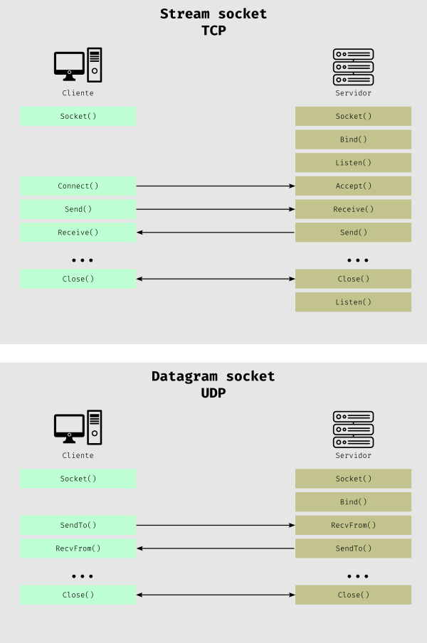

# Resultados de aprendizaje y criterios de evaluación

- **RA3**. Programa mecanismos de comunicación en red empleando sockets y analizando el escenario de ejecución.
  - **CE3a**. Se han identificado escenarios que precisan establecer comunicación en red entre varias aplicaciones.
  - **CE3b**. Se han identificado los roles de cliente y de servidor y sus funciones asociadas.
  - **CE3d**. Se ha analizado el concepto de socket, sus tipos y características.

# Sockets

## ¿Qué es un socket?

El término **socket** se refiere a la **interfaz de programación** de aplicaciones para la familia de **protocolos de la arquitectura TCP/IP**. Esta interfaz de programación la proporciona el Sistema Operativo aunque nosotros vamos a usar una capa mayor de abstracción provista por el lenguaje de programación que vamos a usar para programar aplicaciones que usen sockets.

Los sockets constituyen el mecanismo para la entrega de paquetes de datos provenientes de la tarjeta de red a los procesos o hilos apropiados. Un socket queda definido por:

- Un par de direcciones IP local (origen) y remota (destino)
- Un protocolo de transporte
- Un par de números de puerto local (origen) y remoto (destino)

> Necesitas especificar IP y puerto de origen para que el host destinatario pueda responder al origen.

## Tipos de socket

Podemos reducir los tipos de sockets en dos: **Stream Sockets** y **Datagram Sockets**.

Los **Stream Sockets** son confiables y orientados a la conexión, es decir, usan el protocolo de transporte **TCP**. Estos sockets son usados por aplicaciones como: el navegador web (que usan HTTP), Telnet o SSH, por ejemplo.

Los **Datagram Sockets** son sockets sin conexión y no confiables, es decir, usan el protocolo de transporte **UDP**. Estos sockets son usados por aplicaciones como. DHCP, juegos online, video y audio por *streaming*, entre otros.

> Existen dos tipos de sockets más que son los **Raw Sockets** para enviar datos sin un protocolo específico y **WebSocket** para trabajar con **TCP** sobre el protocolo (puertos) HTTP (80) y HTTPS (443) y están soportados por los navegadores web.

## Arquitectura Cliente/Servidor (C/S)

Los sockets nos permiten escribir programas C/S que es la arquitectura en al que se basan la mayoría de los servicios de red e Internet.

En esta arquitectura tenemos:

1. **Un proceso (programa) a la escucha llamado servidor** que tendrá que tener una **IP fija** y un **puerto determinado** y, también, fijo.

2. **Un proceso (programa) que inicia la comunicación llamado cliente** que necesita conocer la dirección IP y puerto del servidor. Este cliente puede cambiar de IP y puerto porque es quien inicia la conversación y, por tanto, en este inicio informará de su IP y puerto al servidor.

La imagen de abajo muestra cómo se inicia, se lleva a cabo y finaliza una conversación entre un cliente y un servidor usando *Stream Sockets* y *Datagram Sockets*:

Como ves, en los *Stream Sockets* hay que establecer una conexión y cerrarla, mientras que en los *Datagram Sockets* no hay que establecer una conexión ni cerrarla.

Además, como ya he comentado, y aunque no se ve en la imagen, los *Stream Sockets* garantizan que los paquetes lleguen y, además, lo hagan en orden.
